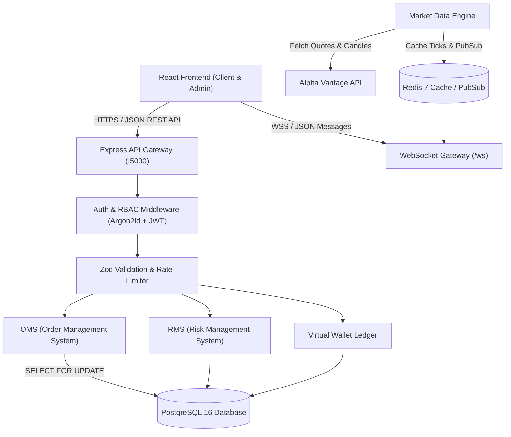

# System Integration Architecture Map

## 1. High-Level Data Flow Topology



---

## 2. Order Execution Architecture

```text
Client Order Ticket / Strategy Builder
    ↓
POST /api/v1/orders (Idempotency-Key)
    ↓
Authentication & Role Verification (JWT)
    ↓
RMS Validation (Margin Check, Limits, Short Sale Rules)
    ↓
Virtual Wallet Ledger (Atomic SELECT FOR UPDATE Margin Lock)
    ↓
PostgreSQL orders Table (Status: ACCEPTED)
    ↓
ExecutionEngine Loop (500ms Matching Cycle)
    ↓
Fill Execution (Status: FILLED)
    ↓
PortfolioService (Positions & Holdings Update)
    ↓
WebSocket Broadcast (ORDER_UPDATE & TRADE_EXECUTION to Client)
```

---

## 3. Live Market Data Architecture

```text
Alpha Vantage Market Provider (1 req/sec throttled)
    ↓
MarketDataEngine Normalizer
    ↓
Redis Key Cache (tick:<token>) & Pub/Sub Channel (market:ticks)
    ↓
WebSocket Gateway Broadcast (/ws)
    ↓
Client Trading Terminal & Option Chain Matrix (Live Update)
```
